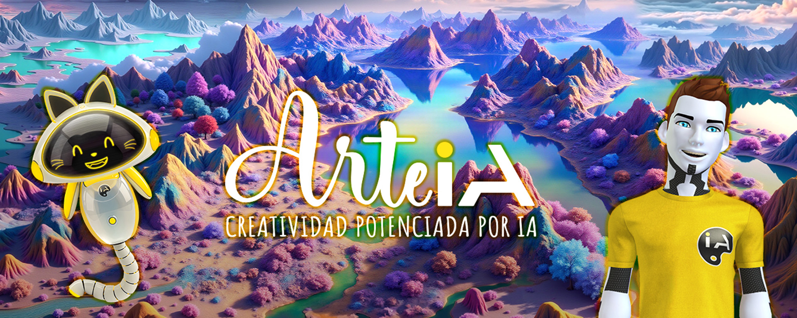
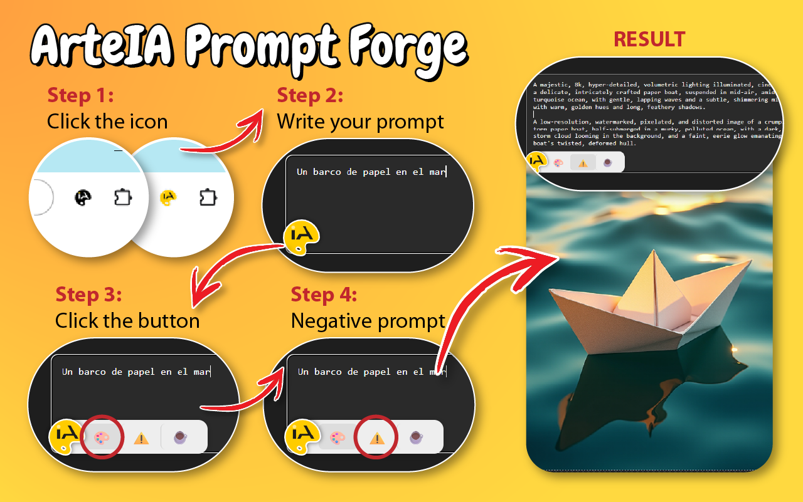
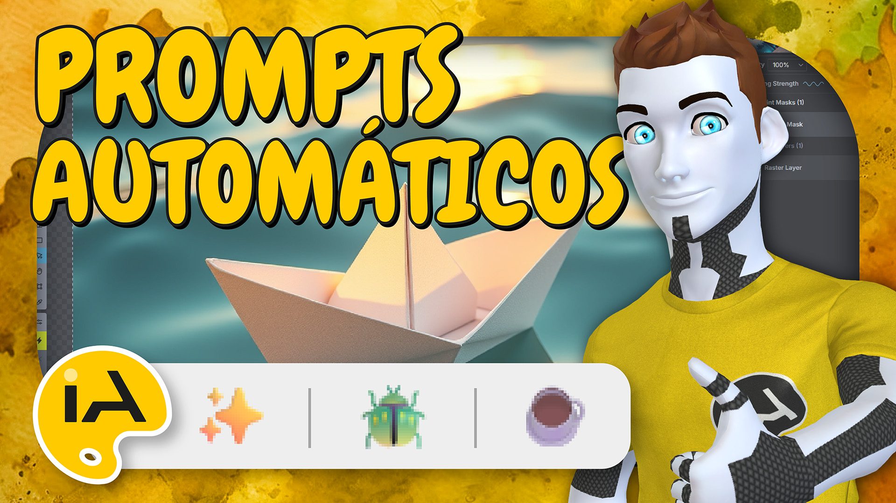

<div align="center">
  
</div>

# 🔥 ArteIA Prompt Forge

**Turn any image description into optimized prompts for AI models like Stable Diffusion.**  
Built with Cloudflare Workers, Llama 3, and a simple interface for fast testing.  
This repository contains the system core: the backend and the testing frontend.

---

## ✅ Official Chrome Extension now available!

🎉 You can now install the official extension directly from the Chrome Web Store:  
👉 [ArteIA Prompt Forge on Chrome Store](https://chromewebstore.google.com/detail/mofdjmeahlghndjffcdmbfljimkpeame?utm_source=item-share-cb)

No configuration required. Just install, click, and create!

---

## ⚠️ IMPORTANT: You need your own Worker

This version of the project **does not include the official API**.  
To make it work properly, you must deploy your own Worker on Cloudflare by following the instructions below.
> 💡 *This only applies to the developer/test version. The official browser extension already works out of the box.*

You also need to configure the file `xt/forge-core.js` and replace:

```js
const apiURL = "YOUR_API_URL";  // ← e.g. https://your-name.username.workers.dev
const apiKey = "YOUR_API_KEY";  // ← If your API requires a custom key
```

> If you skip this step, the extension will throw an error when generating prompts.

---

## ⚙️ What does it do?

You enter something like:

> _"A warrior woman with glowing tattoos in an enchanted forest, fantasy illustration, medium shot"_

And it returns a prompt like:

```
a glowing tattooed warrior woman, fantasy illustration style, 8k, high quality, masterpiece, in an enchanted forest with magical light, walking through the foliage, cinematic medium shot
```

Along with the automatically generated **negative prompt**:

```
deformed face, extra limbs, blurry eyes, watermark
```

Additionally:
- You can regenerate the last prompt by pressing `Shift + click` on the forge button.
- You can also insert the last generated *negative prompt*.
- You can generate text in any language and the extension will take care of translating it.

---

## 🧠 Technologies used

| Area          | Stack                                                                 |
|---------------|-----------------------------------------------------------------------|
| Worker        | [Cloudflare Workers](https://developers.cloudflare.com/workers/)     |
| AI            | [Llama-3-8B Instruct](https://developers.cloudflare.com/workers-ai/models/meta/llama-3-8b-instruct) |
| Frontend test | HTML + Vanilla JavaScript                                             |
| Chrome Extension | Manifest V3 + floating UI                                         |
| Tooling       | Wrangler 3/4, TypeScript                                              |

---

## 🛡 Security

- This repo **does not include real keys or working endpoints by default**.
- Sensitive variables are isolated in `.env` and `wrangler.jsonc`.
- You can implement extra validation in your Worker (like extension ID protection or integrity verification).

---

## 📸 How it works
<div align="center">
  
</div>

---

## 🧩 Chrome Extension

Includes a floating interface on any `textarea`.  
You just need to:
- Activate the extension (by clicking its icon).
- Click the floating logo next to a field.
- Forge your prompt with a single click.

🎨 You can visually customize the extension from the files in `xt/`.

---

## 🎬 YouTube Tutorial

<p align="center">
  <a href="https://youtu.be/MBThPasTliY" target="_blank">
    
  </a>
</p>

---

## ☕ Credits & Support

This project is part of the [ArteIA](https://youtube.com/@arteia) universe, driven by a community that loves art, AI, and well-crafted ideas.

👉 [ko-fi.com/arteia](https://ko-fi.com/arteia) if you'd like to buy me a coffee and support the project.

---

🔧 Project created by [ArteIA](https://youtube.com/@arteia)  
🎨 Tools, workflows, and tutorials on AI-powered art
